 <h1 align="center">Exercise Tracker</h1>

 <br>

## About The Project

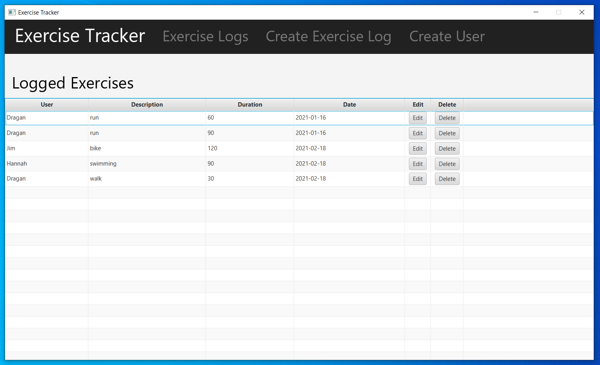

This is an application that functions as an exercise tracker. It was created using Java, JavaFX, the SceneBuilder editor tool, and MySQL.

For the backend, it uses a schema called "exercise_tracker_database", along with a "users" table, an "exercises" table and a "login" table using MySQL Server and Workbench.
* The users table is a table that holds entries that contain the columns <i>user_id</i>, and <i>user</i>, these columns are referencing "User Data" entries. The <i>user_id</i> column is the primary key and it automatically increments. The <i>user</i> column contains the name of a user that can be selected when creating an exercise log.
* The exercises table is a table that holds exercise log entries that contain the columns <i>exercise_id</i>, <i>user</i>, <i>description</i>, <i>duration</i>, and <i>date</i>, these columns are referencing "Exercise Log Data" entries. The ID column is the primary key and it automatically increments, the <i>user</i> column contains the name of a selectable user, the <i>description</i> column contains the description of the exercise, the <i>duration</i> column is how long the exercise was done for (in minutes), and the <i>date column</i> is the date in which the exercise occurs. 
* The login table is a table that holds entries containing the columns <i>username</i> and <i>password</i>. These columns are referencing username and password login information to enter the system.

For the frond end, it is using the ExerciseTracker-Java project folder. In it's src folder, it contains a dbutil package, a login package, an exerciselogs package, an editexerciselog package, a deleteexerciselog package, a createuser package, and a createexerciselog package. The login, exerciselogs, editexerciselog, deleteexerciselog, createuser, and createexerciselog packages use a model-view-controller pattern to develop each window of the application.
* The dbutil package contains the java class file DatabaseConnection.java, which is used to establish a connection to the MySQL database on the schema "exercise_tracker_database" by using the appropriate credentials and URL of the database.
* The login package contains LoginModel.java, LoginController.java, Login.java, and Login.fxml. They are the model, controller, view and fxml files respectively for the initial window that appears when the program is launched.
* The exerciselogs package contains ExerciseLogs.fxml, ExerciseLogsController.java, and ExerciseLogsModel.java. They are the view, controller and model files respectively for the window that launches the Exercise Logs page upon successful login into the application via the first window. This window lists all of the exercise logs in the system.
* The editexerciselog package contains EditExerciseLog.fxml, EditExerciseLogController.java, and EditExerciseLogModel.java. They are the view, controller and model files respectively for the window that launches the Edit Exercise Log page where exercise logs can be edited.
* The deleteexerciselog package contains DeleteExerciseLog.fxml, DeleteExerciseLogController.java, and DeleteExerciseLogModel.java. They are the view, controller and model files respectively for the window that launches the Delete Exercise Log page where exercise logs can be deleted.
* The createuser package contains CreateUser.fxml, CreateUserController.java, CreateUserModel.java, and UserData.java. The first 3 files are the view, controller and model files respectively and UserData.java file defines the structure of each user in the database. This page is for the Create User page and is used to create users in the system to be selectable when creating an exercise log.
* The createexerciselog package contains CreateExerciseLog.fxml, CreateExerciseLogController.java, CreateExerciseLogModel.java, and ExerciseLogData.java. The first 3 files are the view, controller and model files respectively and ExerciseLogData.java file defines the structure of each exercise log in the database. This page is for the Create Exercise Log page and is used to create new exercise logs in the system.

<br>

## Getting Started

### Prerequisites
The JavaFX SDK needed to be imported as a library in the build path.

The following run configurations needed to be set as VM arguments:
```sh
--module-path "C:\Program Files (x86)\Java\jre1.8.0_91\lib\javafx-sdk-15.0.1\lib" 
--add-modules javafx.controls,javafx.fxml
```

A MySQL JDBC driver had to be imported to provide the program with a connection to the MySQL database.

<br>

## Usage
The basic functionality of the application is as follows:

* The program is launched and the Exercise Tracker windows appears.

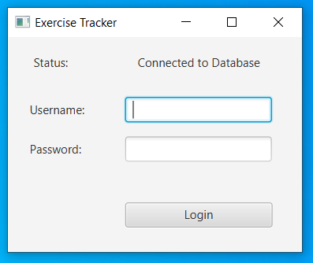

<hr>

* The user must enter the right credentials as per the login table of the exercise_tracker_database schema and click the login button.

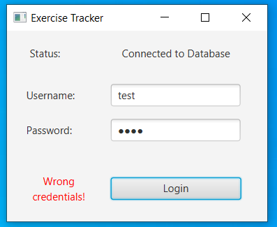
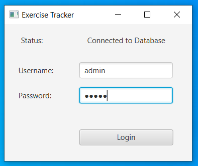

<hr>

* This brings up the Exercise Logs page of the application, which displays all of the logged exercises. It can also be accessed at any time by clicking "Exercise Logs" in the navbar on the top of the page. From here, a user can either edit or delete an exercise log. Clicking the edit button brings the user to a page where they can edit the exercise log. Clicking the delete button will delete the exercise log from the list.


<hr>

* Clicking the edit button on any of the rows will bring up the Edit Exercise Log page, where the user can edit any of the aspects of the selected exercise log. Clicking the Edit Exercise Log button will update the respective exercise log in the Logged Exercises list on the Exercise Logs page of the application.


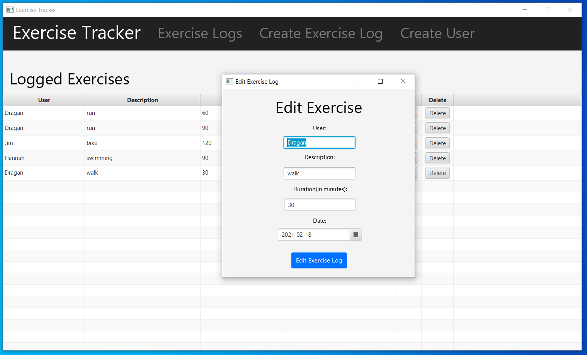

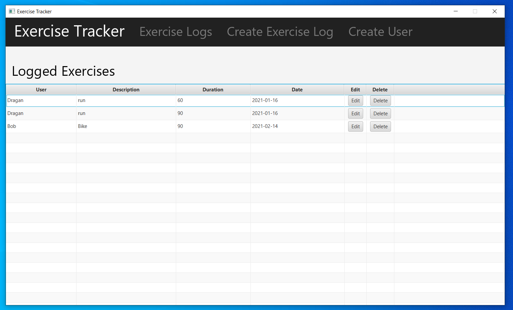

<hr>

*  Clicking the delete button on any of the rows will bring up the Delete Exercise Log page, where the user can delete the selected exercise log. Selecting Yes on the page will delete the exercise log from the system.

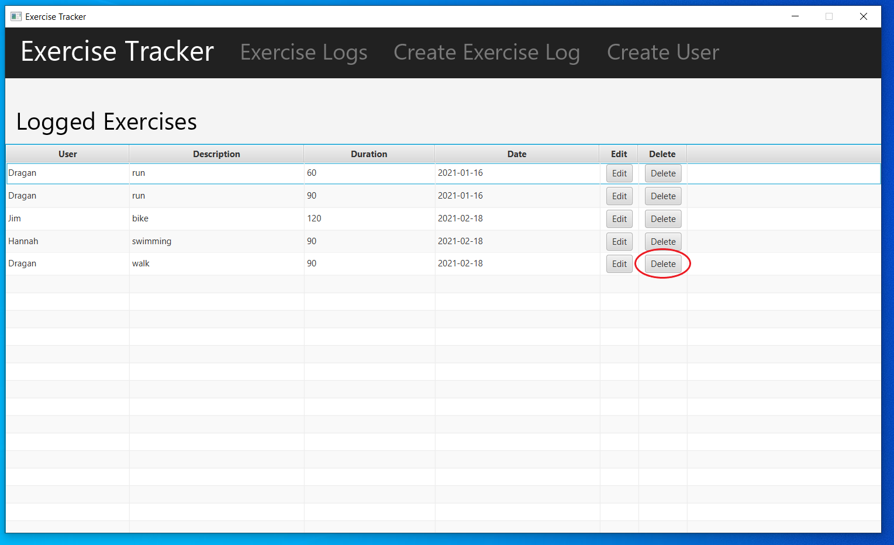
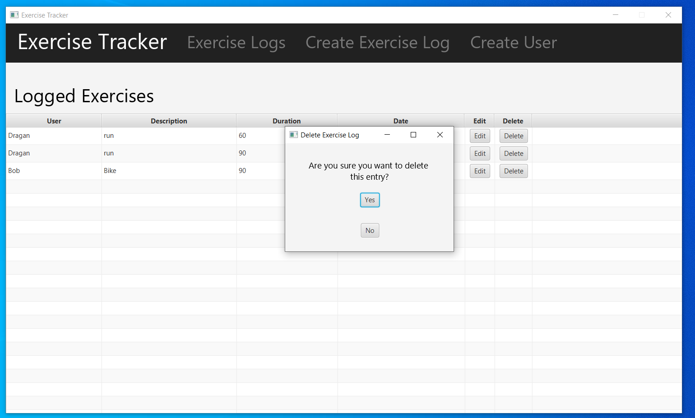
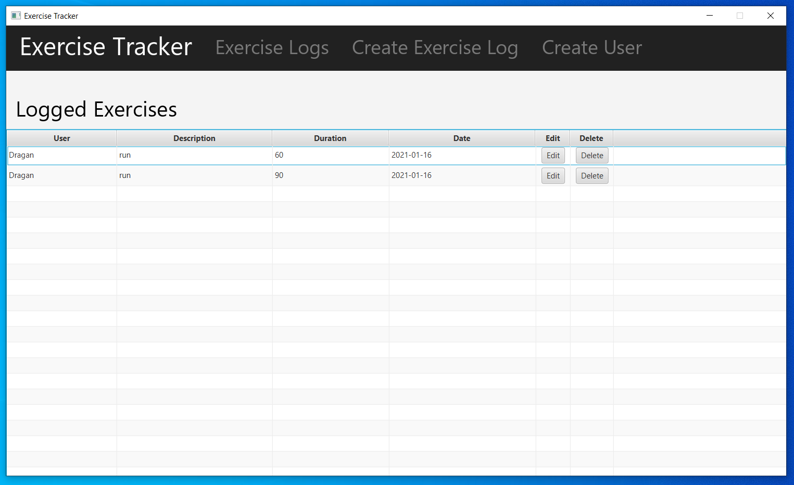

<hr>

* Clicking Crate User in the navbar on the top of a page will bring the user to the Create User page, where they can create a new user to be entered in the Username section of an exercise log.

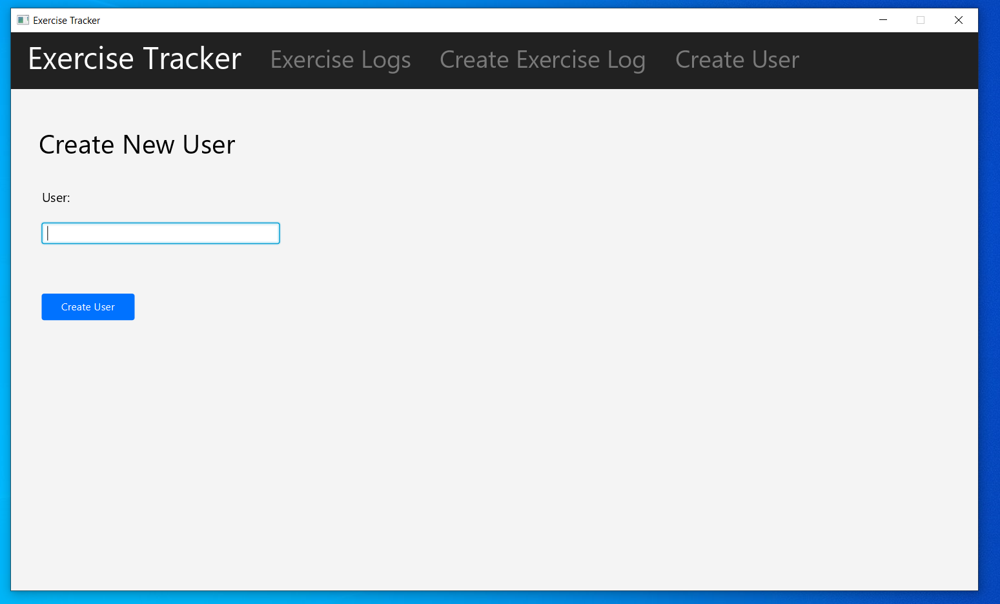
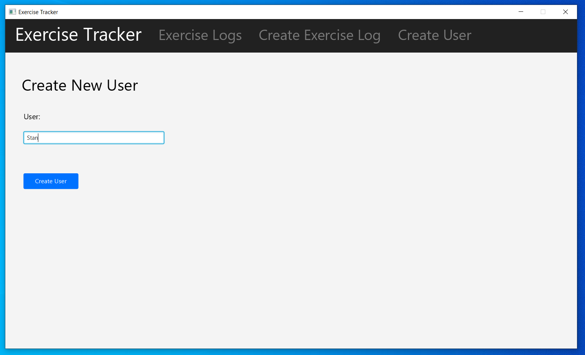


<hr>

* Clicking Create Exercise Log of the navbar on the top of a page will bring the user to the Create Exercise Log page, where they can create a new exercise log.

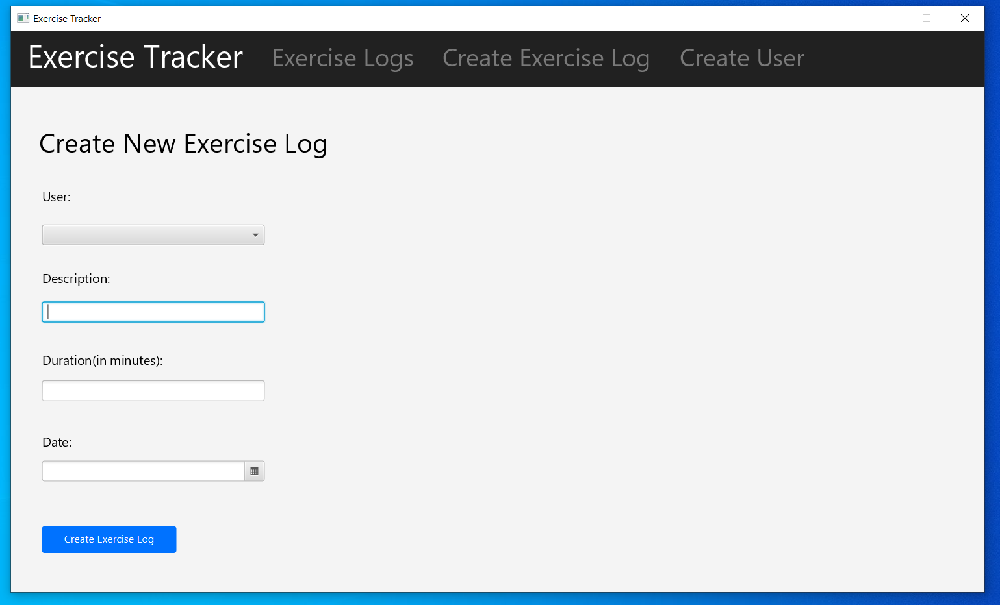


